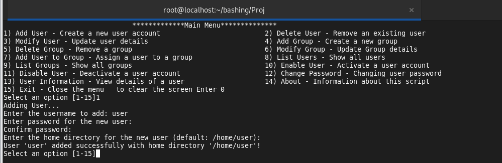

# User and Group Management Tool (Linux Administration)

## Overview
This project is a comprehensive **User and Group Management Tool** for Linux systems. It provides efficient, automated solutions for common administrative tasks, making system management faster and less error-prone.

## Features
- Add, modify, and delete users/groups.
- List users and groups.
- Enable or disable users.
- Change passwords for users.
- GUI and CLI interfaces to suit various preferences.
- Automates repetitive tasks, improving efficiency.

---

## Tools Used
- **Bash Scripting:** For both CLI and GUI versions.

---

## Implementations and Screenshots

### Bash (select)
- **Description:** A simple, menu-based tool. Suitable for CLI enthusiasts and quick tasks. Navigable using keyboard input.
- **Screenshot:**
  

## Installation and Usage
### Requirements
- Linux Operating System.
- Bash Shell (pre-installed in most Linux distributions).
 
 
